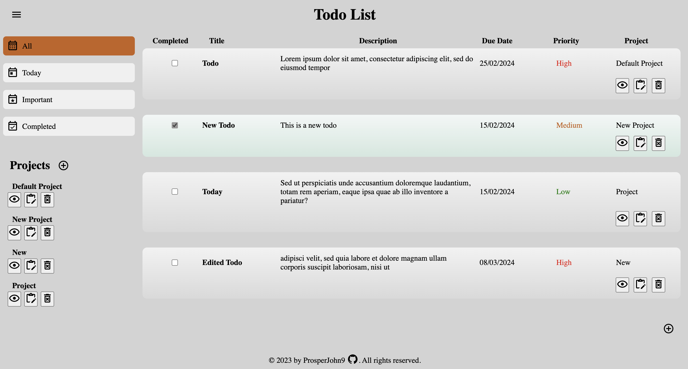
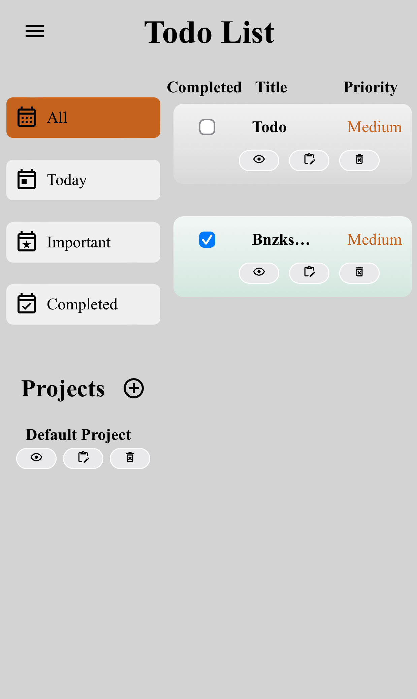

# TODO-LIST
Live demo: 
https://prosperjohn9.github.io/todo-list/dist/

Desktop View:

Mobile View:

This project was created for the [Todo List](https://www.theodinproject.com/lessons/node-path-javascript-todo-list) assignment as part of The Odin Project curriculum. I met all the assignment objectives and then expanded on it with my own concepts to make it more functional and user-friendly.

## Provided Assets
* Examples: 
  - [todoist.com](https://en.todoist.com/)
  - [Things](https://culturedcode.com/things/)
  - [any.do](https://www.any.do/)
* [date-fns](https://github.com/date-fns/date-fns)
* localStorage
* JSON

## Objectives
1. Have projects or separate lists of todos
2. ‘Default’ project to which all todos are put
3. Create new projects and choose which project todos go into
4. UI Requirements:
   - View all todos
   - View todos in each project
   - Edit todos
   - Delete todos
5. Separate application logic from DOM manipulation
6. Use Web Storage API to store data